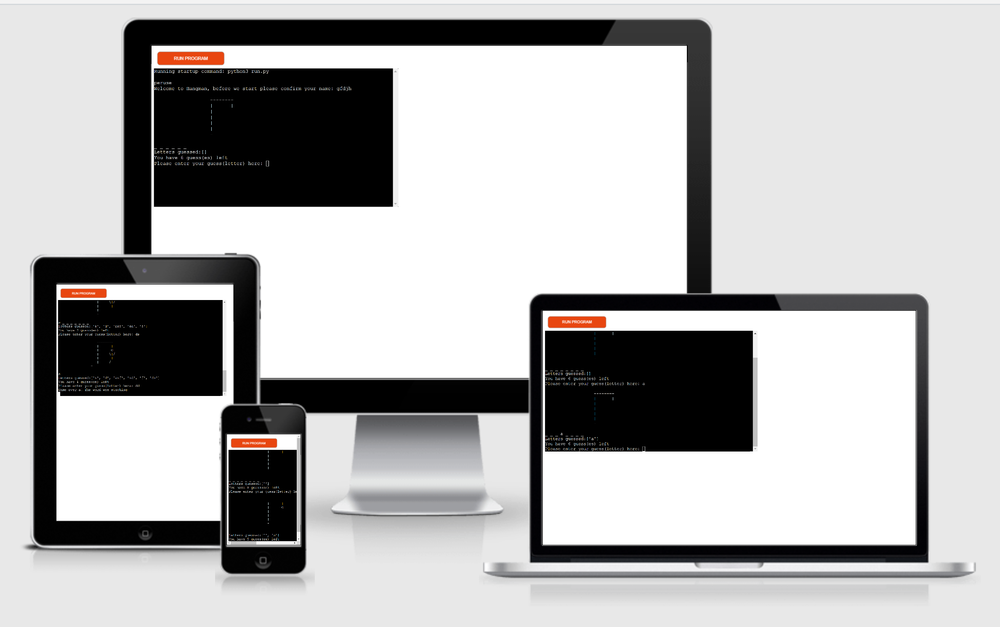
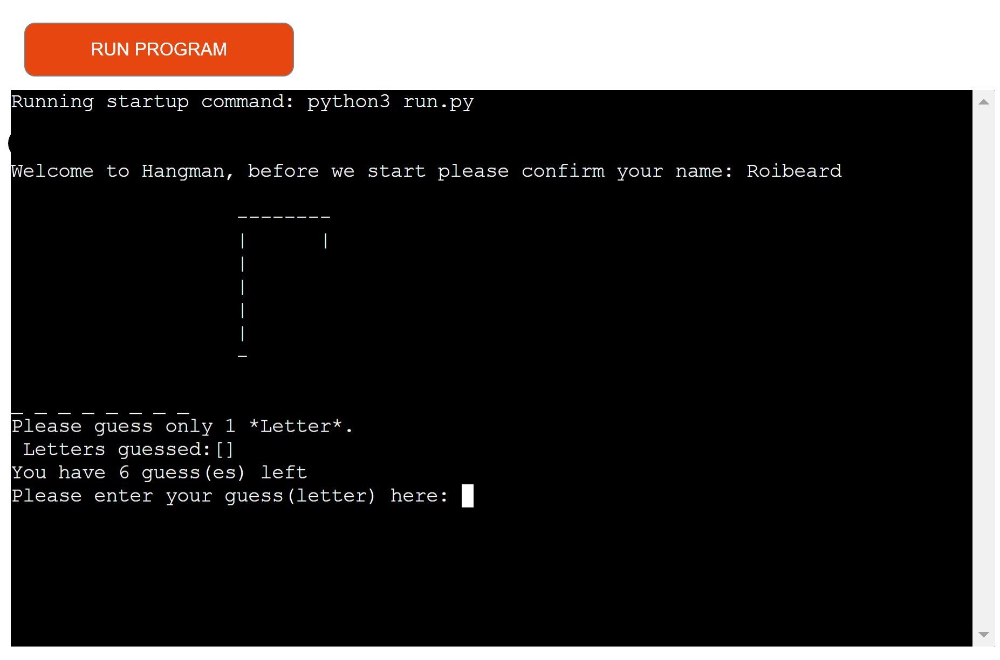
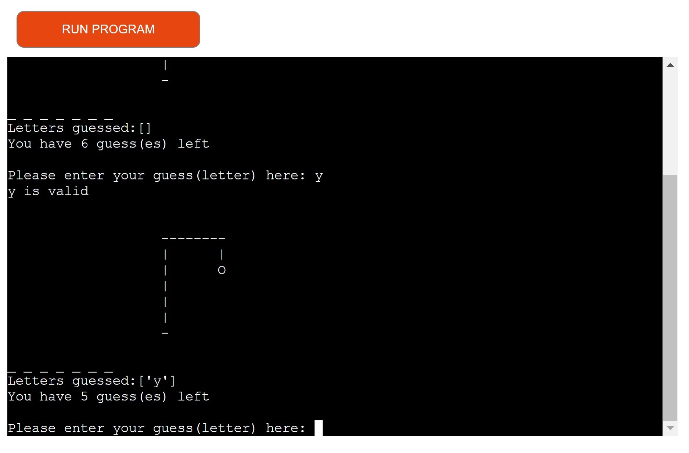
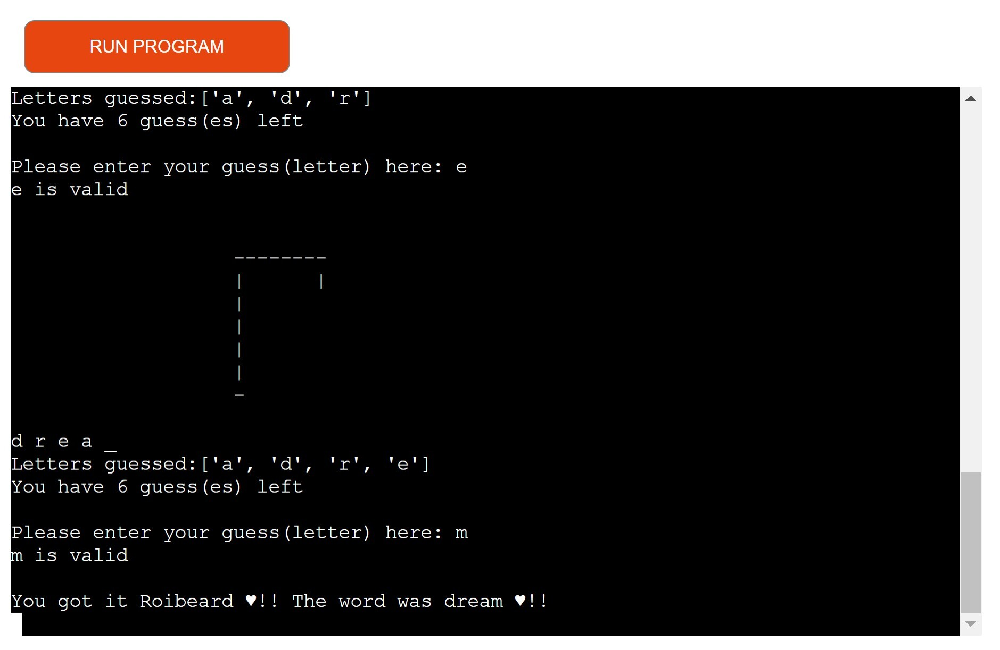
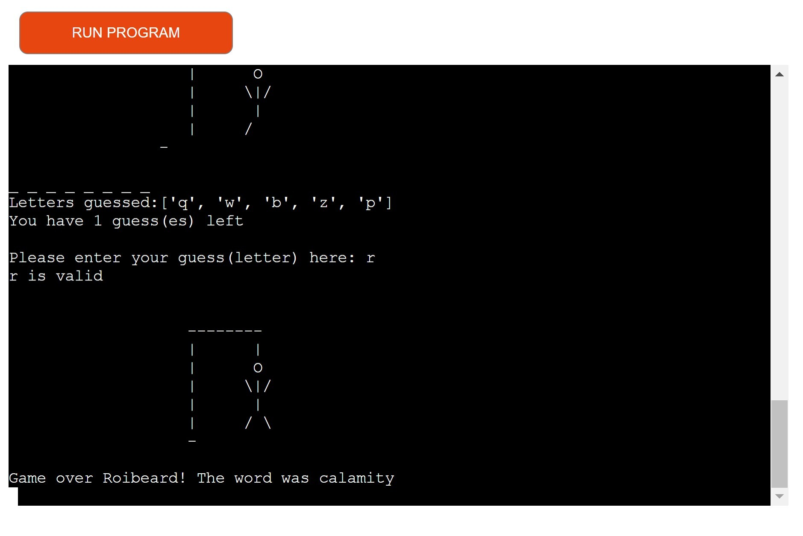
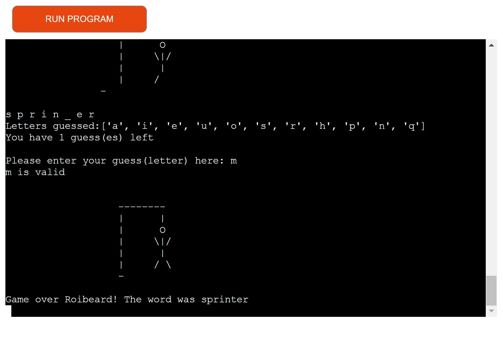
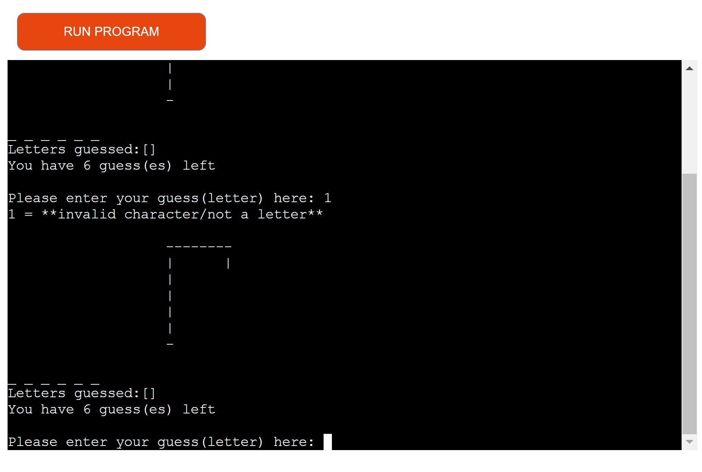
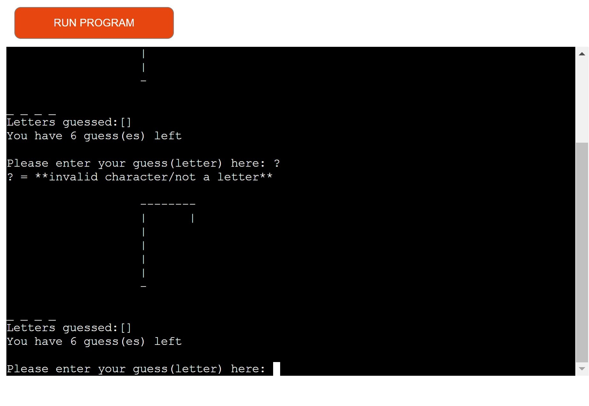
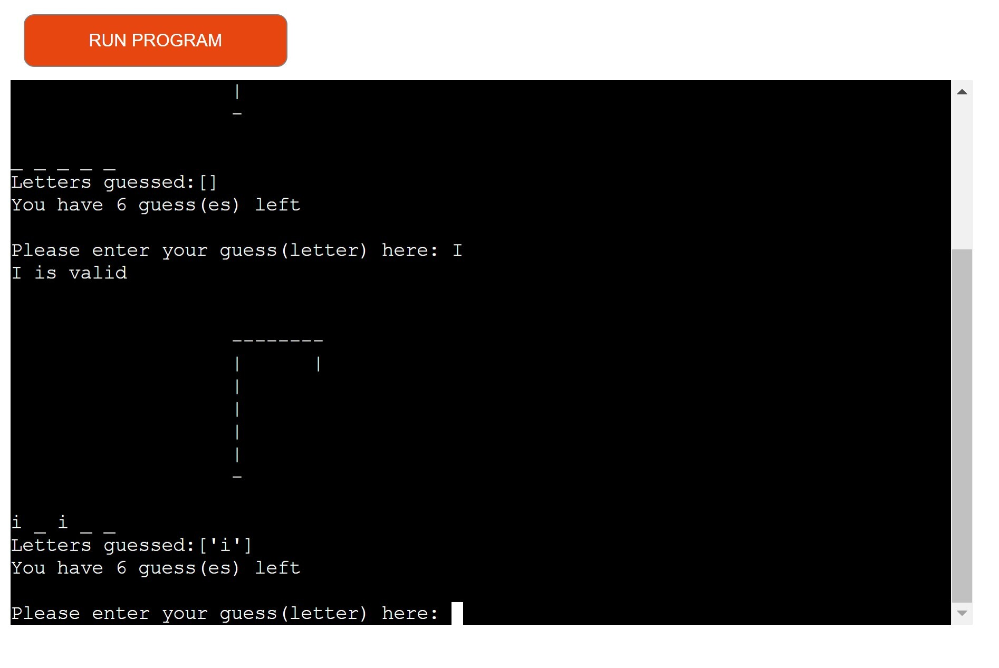
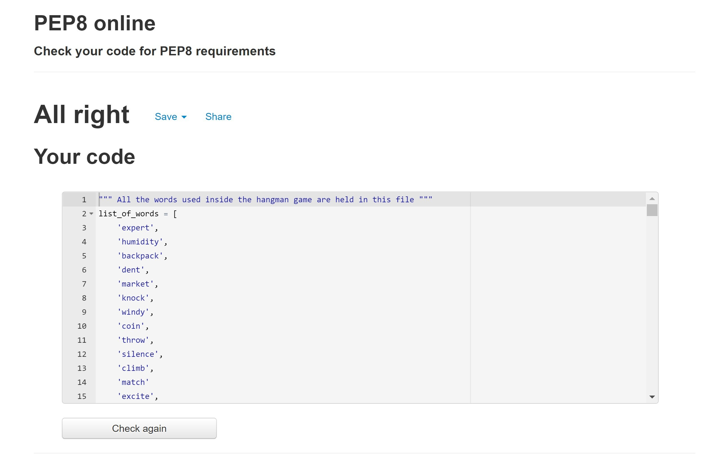

### Hangman 
This is the famous children's game of Hangman, that I often enjoyed playing in my early school days. A player's objective is 
to identify the hidden word of which only the number of letters is originally revealed using underscore symbols. In each 
round, the player guesses a letter of the alphabet. If the letter is present in the word, it will take up 
the correct position, beside the otherwise empty underscore symbols yet to be guessed. If the letter is not present in the word, then one of the hangman's body parts appears to display one more piece of the hangman image. 

The game ends in a win if the word is entirely revealed by correct guesses, and ends in loss if the hangman's body is 
completely revealed instead. To assist the player, a visible record of all guessed letters is maintained. The user does 
not lose any guesses if a number or non-valid character is entered.

This Hangman game is completed in the command line & deployed using Heroku.
Select from a list of 100 random words, ranging in difficulty.

  

### Live Prototype Demo
[Live link here](https://hangman-new.herokuapp.com/)

### Flow Chart
 

### Hangman Format
- Introduction:
 
- The first answer wrong:
 
- All correct answers without getting one wrong:
 
- All answers wrong:
 
- You win some you lose some:
 
- Wrong character entered via entering a number:

- Wrong character entered,via a question mark:

- Capital letter entered, & transitioned to a lowercase:

### Validator Testing
Python checker- PEP8-All right
- run.py page PEP8 test

- words.py page PEP8 test

## Python Libraries
random
- Used to randomise the secret words

list-of-words
- A file containing over 100 words to be used to pick a random secret word

### User Demographics & UX
- Anybody who has played hangman before the internet.
- New users have never played hangman before
- People who enjoy testing their abilities to solve puzzles & general word games
- Hangman images are used throughout the game to add to the tension building up to the end of the game.
- The difficulty level is in the hard scale which will be upgraded in the future to varying levels of difficulty from easy to almost impossible.

### Personal Testing
- I consistently tested every new code added to the game via the command terminal & on the deployment page for bugs & errors.
- I wanted the hangman in every guess to signify each stage but it was only appearing on the first guess. I did not want to
have to add print beside every line of every image & split it into various variables to be called after each wrong guess. 
I managed to resolve this by trial & error, by placing a hangman-image command(that calculates the current guesses no) at the beginning of the loop.
- I added a list of the previous errors to be viewed with every request for a new guess.
- Deployment error with not finding run.py- Resolved by removing creds.json after several tests at workarounds & discussing various options with the Tutor team.
- No 404 errors from user input so the error handling did not appear to require a try/exception. When the user enters a character that is not a letter,
an error appears on the terminal notifying the user & no guesses are lost in the process.
- A future fix will be added for when the user either enters an empty string or inputs too many characters. Many efforts made to resolve
crashed the game as per the screenshots below:

### User Stories 
- As a User I want to be able to see the hangman at after each guess
- As a User I want to be able to see which letters I have already guessed so I can choose a new one
- As a User I want to know exactly how many guesses I have left
- As a User I want to have a user-friendly experience, when I win my name is called out in celebration
- As a User I want to test myself against a variety of random difficult words & get the answer in as few guesses as possible
- As a User I want the ability to know when input is required
- As a User I want to receive an error when I enter the wrong input
- As a User I want to see the positioning of the letters when I get them right so that I can make my next guess with more insight
- As a user I want to feel the same excitement I felt when I was playing this game with pen & paper in school

### Deployment
## GitHub
- This project was developed using GitPod, which was then committed and pushed to GitHub using the GitPod terminal. To create a GitHub repository you must:

1. Sign in to your account on Github.
2. On the top left of the home screen, click the 'New' button.
3. Under 'Repository template', select the required template from the dropdown.
4. Enter a repository name and description of your project.
5. You can select if you wish to make this project public or private.
6. There is an option of adding a README file, a .gitignore file, or choosing a license.
7. Click the 'Create Repository' button and your repository will be created.

## Deploying on Heroku
- To deploy this project to Heroku from its GitHub repository, the following steps were taken:

1. In your repository, type "pip freeze > requirements.txt" to create the list of dependencies to the requirements.txt file. Save, commit and push your changes to GitHub.

2. Create an account with Heroku, selecting Python as the 'Primary development language'.

3. Go to your emails and click the link to verify your email address. The link will bring you to a page where you can create a password. Create a password and log in.

4. On the dashboard, click the 'create new app' button. Enter a unique name for your app and select your region. Click 'Create App'.

5. Go to the settings tab and click 'Reveal Config Vars'. Enter PORT as the KEY value and 8000 as the VALUE value.

6. Click 'Add Buildpack' and select 'Python' and 'Nodejs'. Python must be on the top of the list. Click and drag the buildpacks to the correct positions if needed.

7. Go to the deploy tab and, under 'Deployment method', click 'GitHub' and then 'Connect to GitHub'.

8. In 'Connect to GitHub', search for the repository you wish to use, then click 'Connect'.

9. If you 'Enable Automatic Deploys', Heroku will rebuild the app every time you push a change to GitHub. You can also choose to manually deploy using the 'Deploy Branch' option. Heroku will build the app and when it is finished, click the 'View' button to open the terminal.

### Ackowledgments
Thank you to my Mentor Felipe Souza Alarco for all of our insightful meetings, particularly the one just before submission.
Thank you to Kasia who is always there to inspire, advise & support whenever needed.
I watched various different helpful tutorials on YouTube on how to build a Hangman game from FreeCodeCamp to CBT Nuggets but I attempted to build it my own way.
Thank you to the excellent Customer Support & Tutor teams. Thank you to all the slackers on slack & the in-it-together calls, particularly Daisy_Mentor for her help & assistance.